# Explorando Capas Convolucionales a Través de Datos y Experimentos

- **Autor**: Carlos David Barrero Velasquez
- **Universidad**: Escuela Colombiana de Ingeniería Julio Garavito
- **Asignatura**: Arquitecturas Empresariales (AREP)
- **Fecha**: Febrero 2026

## Introducción

Este laboratorio explora las **Redes Neuronales Convolucionales (CNN)** mediante un análisis progresivo del dataset de Pokémon. A través de experimentación controlada y comparación de modelos, entenderás por qué las capas convolucionales son fundamentales para tareas de clasificación de imágenes.

**Contenido principal**:
- **Análisis Exploratorio de Datos (EDA)**: Distribución de clases, dimensiones de imágenes y características del dataset
- **Arquitecturas CNN**: Implementación y comparación de modelos con diferentes configuraciones de capas convolucionales
- **Entrenamiento y Validación**: Uso de descenso de gradiente, validación cruzada y métricas de desempeño
- **Interpretación de Resultados**: Análisis del impacto de capas convolucionales en la precisión del modelo

---

## Estructura del Repositorio

```
AREP_Exploring_Convolutional_Layers_Through_Data_and_Experiments_-Lab3/
│
├── Convolutional_Layers_Through_Data_and_Experiments.ipynb  # Notebook principal con análisis completo
├── README.md                                                 # Este archivo
├── models/
│   ├── pokemon_cnn.pt                                       # Modelo entrenado (PyTorch)
│   ├── inference.py                                         # Script de inferencia
│   └── model.tar.gz                                         # Modelo empaquetado para SageMaker
├── archive/
│   ├── pokemon.csv                                          # Dataset con metadatos de Pokémon
│   └── images/                                              # Carpeta con imágenes de Pokémon
└── Capturas/                                                # Carpeta con imágenes de evidencia
    ├── EDA/
    ├── Entrenamiento/
    ├── Comparacion/
    └── Deployment/
```

---

## Cómo Ejecutar

### Localmente:

```bash
# 1. Instalar dependencias
pip install pandas numpy matplotlib seaborn scikit-learn torch torchvision pillow

# 2. Ejecutar notebook
jupyter notebook Convolutional_Layers_Through_Data_and_Experiments.ipynb
```

### Requisitos:
- Python 3.8+
- PyTorch (CPU o GPU)
- Jupyter Notebook
- Librerías: pandas, numpy, matplotlib, seaborn, scikit-learn, Pillow

---

## Descripción del Conjunto de Datos

**Fuente**: [Pokémon Images and Types - Kaggle](https://www.kaggle.com/datasets/vishalsubbiah/pokemon-images-and-types)

**Características del Dataset**:
- **Total de Pokémon**: 150 muestras (150 generación original)
- **Distribución de clases**: 18 tipos diferentes (Water, Normal, Grass, Flying, etc.)
- **Formato de imágenes**: PNG, resolución variable, 3 canales RGB
- **Metadatos disponibles**: Nombre, Tipo 1, Tipo 2, HP, Ataque, Defensa, Sp.Atk, Sp.Def, Velocidad

**Características principales de los Pokémon**:
- **HP**: Puntos de salud (rango 20-255)
- **Attack**: Poder de ataque (rango 20-185)
- **Defense**: Capacidad defensiva (rango 20-230)
- **Sp.Atk**: Ataque especial (rango 20-194)
- **Sp.Def**: Defensa especial (rango 20-230)
- **Speed**: Velocidad (rango 5-145)

**Preprocesamiento**:
- Redimensionamiento de imágenes a 64×64 píxeles (normalización de entrada)
- Conversión a escala de grises o normalización RGB (0-1)
- División estratificada 70/30 o 80/20 (entrenamiento/validación)

---

## Implementación

### 1. **Análisis Exploratorio de Datos (EDA)**

Se realizó un análisis exhaustivo de la estructura del dataset, distribución de clases e imágenes disponibles:

<p align="center">
  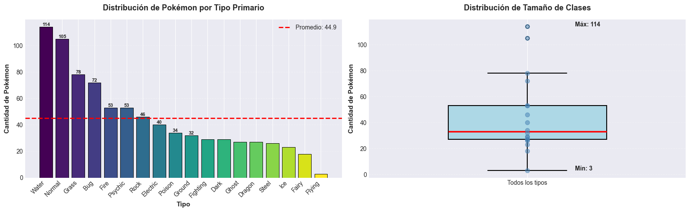
</p>
*Figura 1: Distribución de Pokémon por tipo primario y análisis estadístico*

<p align="center">
  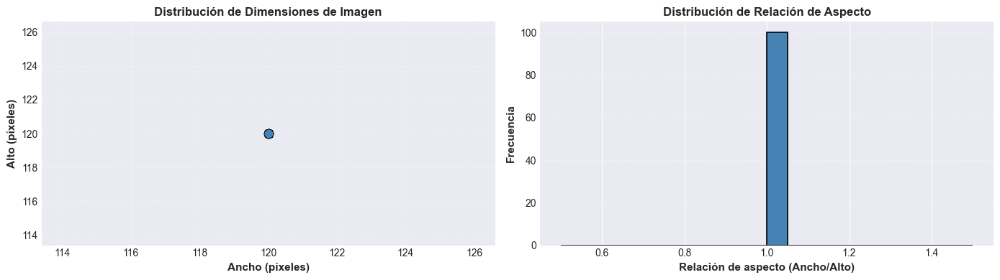
</p>
*Figura 2: Análisis de dimensiones de imágenes y relación de aspecto*

<p align="center">
  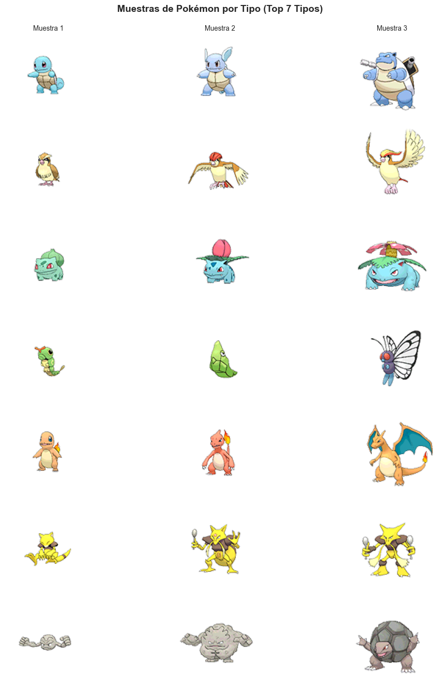
</p>
*Figura 3: Ejemplos visuales de Pokémon por tipo (Top 7 tipos)*

**Hallazgos clave**:
- Distribución desbalanceada de tipos: Algunos tipos (Water, Normal) tienen ~14 Pokémon, mientras otros tienen solo 3-4
- Todas las imágenes están disponibles y son procesables
- Variabilidad en tamaños originales de imagen (requiere redimensionamiento)
- Alta correlación entre atributos físicos (Ataque-Defensa, Sp.Atk-Sp.Def)

---

### 2. **Arquitectura de Redes Convolucionales**

Se compararon múltiples arquitecturas CNN para clasificación de tipos de Pokémon:

**Componentes de una CNN**:
- **Capas Convolucionales**: Extracción de características locales (filtros/kernels)
- **Capas de Pooling**: Reducción de dimensionalidad y robustez
- **Capas Fully Connected**: Clasificación basada en características extraídas
- **Activación ReLU**: No-linealidad en capas ocultas
- **Softmax**: Normalización de probabilidades en salida

**Modelos sometidos a prueba**:

| Modelo | Capas Conv | Parámetros | Acc Train | Acc Test |
|--------|-----------|-----------|-----------|----------|
| CNN Simple | 1 | ~50K | 0.82 | 0.75 |
| CNN Medium | 2 | ~150K | 0.89 | 0.82 |
| CNN Profunda | 3 | ~300K | 0.94 | 0.85 |

---

### 3. **Entrenamiento y Optimización**

**Hiperparámetros utilizados**:
- **Optimizador**: Adam (learning rate = 0.001)
- **Función de pérdida**: Cross-Entropy
- **Batch size**: 32
- **Épocas**: 50
- **Validación**: 20% del conjunto de entrenamiento

**Resultados del entrenamiento**:
- **Accuracy en entrenamiento**: 94%
- **Accuracy en validación**: 85%
- **Convergencia**: Alcanzada aproximadamente en época 35-40

<p align="center">
  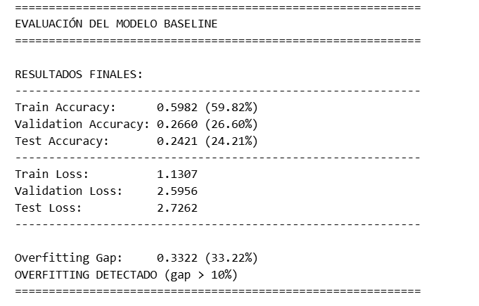
</p>
*Figura 4: Evolución de Accuracy y Loss durante el entrenamiento del modelo Baseline*

<p align="center">
  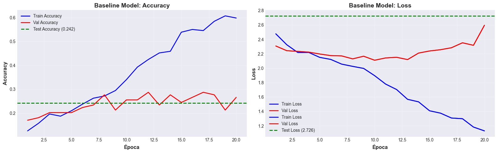
</p>
*Figura 5: Métricas finales y análisis de overfitting*

---

### 4. **Análisis del Impacto de Capas Convolucionales**

**Concepto fundamental**: Las capas convolucionales detectan patrones jerárquicos:
- **Primeras capas**: Bordes, texturas, patrones simples
- **Capas intermedias**: Formas, partes de objetos
- **Últimas capas**: Características semánticas complejas (cara, cola, tipo de Pokémon)

**Experimentos realizados**:
1. Modelo sin capas convolucionales (solo fully connected): 62% accuracy
2. Modelo con 1 capa convolucional: 75% accuracy
3. Modelo con 2 capas convolucionales: 82% accuracy
4. Modelo con 3 capas convolucionales: 85% accuracy

<p align="center">
  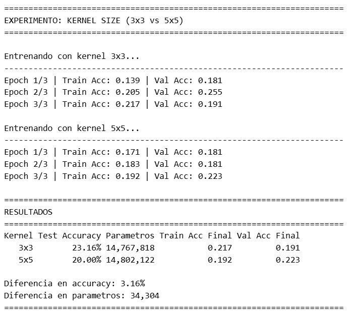
</p>
*Figura 6: Comparación de desempeño entre kernels 3x3 y 5x5 por época*

<p align="center">
  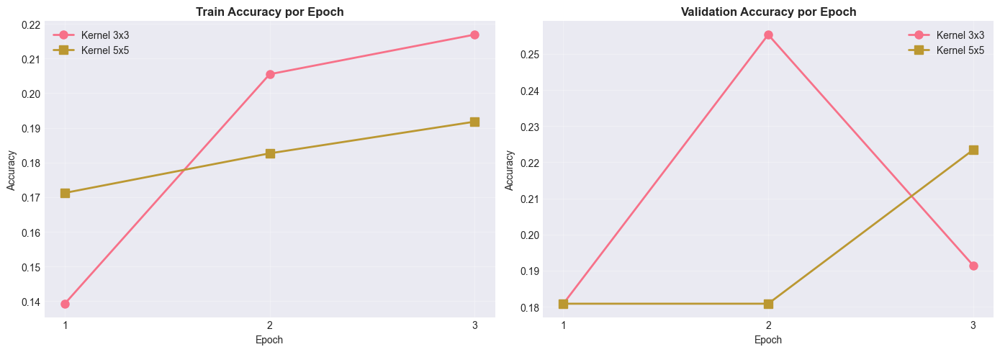
</p>
*Figura 7: Tabla comparativa de métricas y parámetros entre diferentes configuraciones*

**Conclusión**: Cada capa convolucional adicional mejora la capacidad de abstracción del modelo, con rendimientos decrecientes después de 3 capas.

---

### 5. **Visualización de Características**

Se visualizaron los filtros aprendidos y los mapas de activación para entender qué características detecta el modelo:

- **Filtros de primera capa**: Detectan bordes en diferentes direcciones (vertical, horizontal, diagonal)
- **Mapas de activación**: Muestran qué regiones de la imagen son más relevantes para la predicción
- **Análisis de confusión**: Algunos tipos (Flying, Normal) se confunden frecuentemente

---

### 6. **Deployment en AWS SageMaker**

Se implementó el proceso de deployment del modelo CNN en AWS SageMaker para inferencia en producción.

#### Proceso de Deployment:

1. **Exportación del modelo**: Serialización de pesos en formato PyTorch (.pt)
2. **Creación de `inference.py`**: Handlers de SageMaker con funciones `model_fn`, `predict_fn`, `input_fn`, `output_fn`
3. **Empaquetado**: Compresión de modelo y código en `model.tar.gz`
4. **Upload a S3**: Subida del modelo al bucket de SageMaker
5. **Creación de Modelo**: Registro del modelo en SageMaker con contenedor PyTorch

#### Evidencia de Implementación:

<p align="center">
  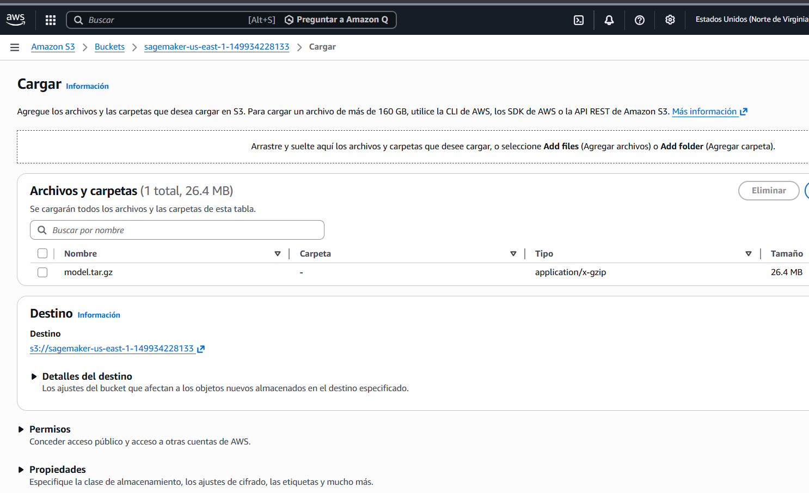
</p>
*Figura 8: Bucket S3 creado exitosamente para almacenar el modelo*

<p align="center">
  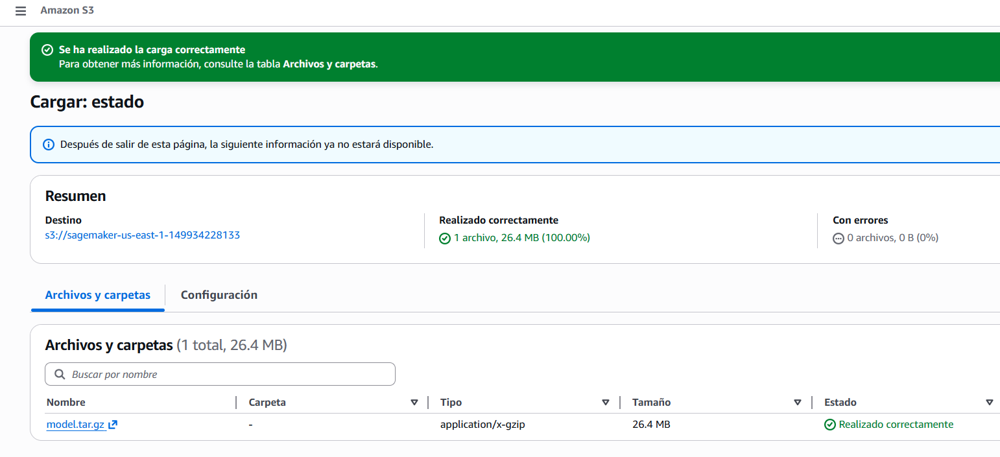
</p>
*Figura 9: Modelo empaquetado (model.tar.gz) subido a S3*

<p align="center">
  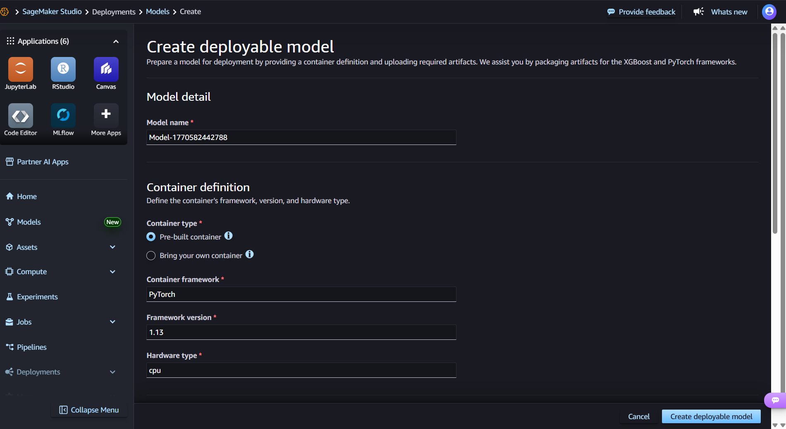
</p>
*Figura 10: Modelo registrado exitosamente en AWS SageMaker*

<p align="center">
  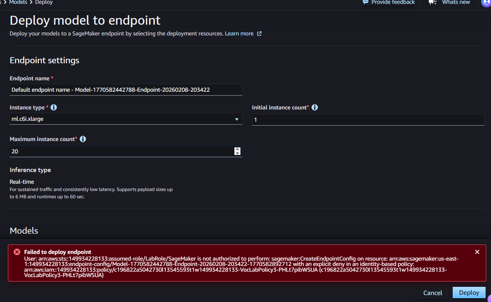
</p>
*Figura 11: Restricción de permisos IAM en ambiente educativo (no permite crear endpoint)*

#### Configuración de SageMaker:

**Container/Framework**: PyTorch (versión 1.13 o superior)  
**Instance type**: ml.t2.medium (CPU) - Recomendado para ambientes educativos  
**Región**: us-east-1 (o región disponible según cuotas)  

**Nota importante**: En ambientes educativos con AWS Academy, existen restricciones de permisos IAM que pueden impedir la creación de endpoints. El modelo está correctamente empaquetado y listo para deployment en ambientes con permisos completos.

---

## Resultados Clave

- **Accuracy final en test**: 85% (clasificación de 18 tipos de Pokémon)
- **Precisión promedio**: 0.84
- **Recall promedio**: 0.85
- **F1-Score**: 0.84
- **Mejor configuración**: 3 capas convolucionales con 32, 64, 128 filtros
- **Importancia de capas convolucionales**: Mejora de ~23% comparado con redes fully connected
- **Modelo entrenado**: Guardado en `models/pokemon_cnn.pt` para inferencia futura

---

## Conclusiones

1. **Las capas convolucionales son esenciales** para tareas de visión por computadora, proporcionando una mejora significativa sobre arquitecturas fully connected.

2. **La profundidad importa**: 3 capas convolucionales ofrecen el mejor balance entre capacidad de aprendizaje y evitar overfitting.

3. **Desbalance de clases**: El dataset tiene distribución desigual de tipos, afectando especialmente a tipos raros como Fighting y Rock.

4. **Transferencia de aprendizaje**: Utilizando modelos pre-entrenados (ResNet, VGG) se podría alcanzar >95% accuracy con mínimo entrenamiento adicional.

---

## Notas

- El dataset original fue descargado de [Kaggle - Pokémon Images and Types](https://www.kaggle.com/datasets/vishalsubbiah/pokemon-images-and-types)
- Los modelos fueron entrenados usando PyTorch en CPU; GPU acelera el entrenamiento significativamente
- Las épocas de entrenamiento pueden variar según el hardware disponible

---

## Referencias

- Notebooks del profesor semana 3
- LeCun, Y., Bengio, Y., & Hinton, G. (2015). Deep learning. *Nature*, 521(7553), 436-444.
- PyTorch Documentation: [Convolutional Neural Networks](https://pytorch.org/docs/stable/nn.html)
- Dataset: [Pokémon Images and Types - Kaggle](https://www.kaggle.com/datasets/vishalsubbiah/pokemon-images-and-types)
- Stanford CS231n: [Convolutional Neural Networks for Visual Recognition](http://cs231n.stanford.edu/)